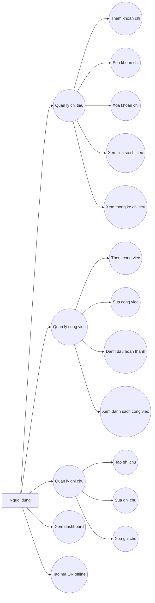
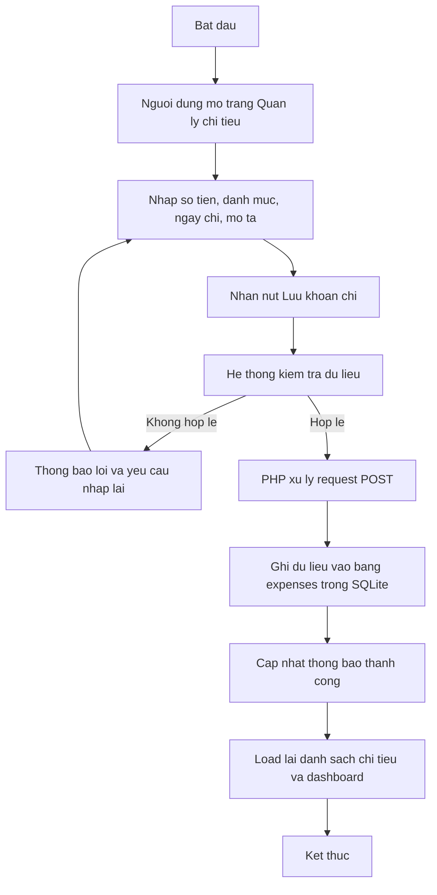
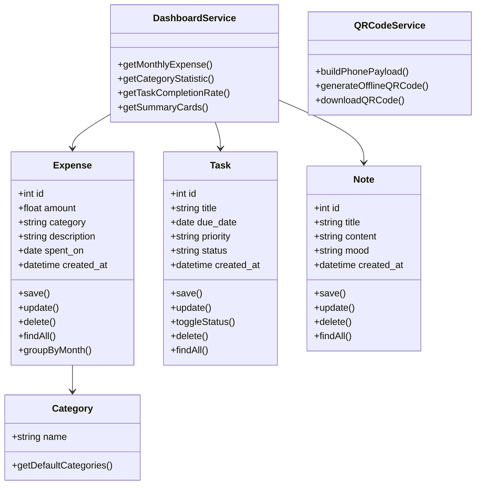
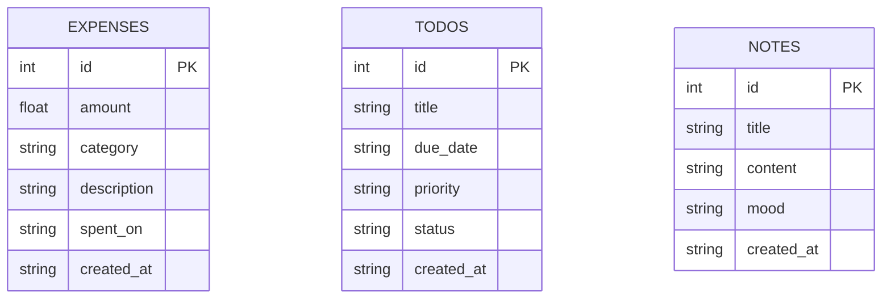

# LifeBoard - Do an PTTK-HTTT

Ung dung demo quan ly ca nhan theo Huong 2, gom:

- Quan ly chi tieu ca nhan
- To-do list quan ly cong viec
- Ghi chu nhanh
- Thong ke truc quan
- Luu du lieu local bang SQLite

## Cach chay

1. Cai XAMPP, WAMP hoac bat mot moi truong PHP co ho tro `SQLite3`.
2. Dat thu muc project nay vao web root, vi du `htdocs`.
3. Mo trinh duyet voi duong dan `http://localhost/PTTK-HTTT/index.php`.
4. Khi them du lieu, file SQLite se duoc tao tu dong trong thu muc `storage/`.

## Diem manh de demo

- Giao dien mot trang, de thao tac va de thuyet trinh.
- Du lieu duoc luu local, phu hop yeu cau mon hoc.
- Co thong ke theo thang va theo danh muc.
- De mo rong them dang nhap, nhac lich, xuat bao cao.

---

## Phan tich va thiet ke he thong

Phan duoi day bo sung cho bao cao mon Phan tich va Thiet ke He thong Thong tin, ap dung cho ung dung `LifeBoard`.

### 1. Use Case Diagram

#### Actor

- `Nguoi dung`
  - La nguoi su dung duy nhat cua he thong.
  - Tu them, sua, xoa, xem du lieu ca nhan.

#### Danh sach use case

- `Quan ly chi tieu`
- `Them khoan chi`
- `Sua khoan chi`
- `Xoa khoan chi`
- `Xem lich su chi tieu`
- `Xem thong ke chi tieu theo thang`
- `Quan ly cong viec`
- `Them cong viec`
- `Sua cong viec`
- `Danh dau hoan thanh cong viec`
- `Xem danh sach cong viec`
- `Quan ly ghi chu`
- `Tao ghi chu`
- `Sua ghi chu`
- `Xoa ghi chu`
- `Xem dashboard tong quan`
- `Tao ma QR offline`

#### Mo ta ngan tung use case

| Use case | Mo ta ngan |
|---|---|
| Quan ly chi tieu | Nguoi dung thao tac voi cac khoan chi ca nhan. |
| Them khoan chi | Nhap so tien, danh muc, ngay chi, mo ta va luu vao he thong. |
| Sua khoan chi | Cap nhat thong tin mot khoan chi da ton tai. |
| Xoa khoan chi | Xoa mot khoan chi khoi danh sach. |
| Xem lich su chi tieu | Xem cac khoan chi da luu, duoc nhom theo tung thang. |
| Xem thong ke chi tieu theo thang | Xem tong chi tieu va bieu do danh muc. |
| Quan ly cong viec | Thao tac voi danh sach to-do. |
| Them cong viec | Tao cong viec moi voi ten, han xu ly, muc uu tien. |
| Sua cong viec | Cap nhat thong tin cong viec. |
| Danh dau hoan thanh cong viec | Chuyen trang thai tu dang lam sang hoan thanh. |
| Xem danh sach cong viec | Theo doi toan bo cong viec va tinh trang cua chung. |
| Quan ly ghi chu | Thao tac voi ghi chu nhanh. |
| Tao ghi chu | Luu noi dung ghi chu moi. |
| Sua ghi chu | Chinh sua noi dung ghi chu da co. |
| Xoa ghi chu | Xoa ghi chu khong can dung nua. |
| Xem dashboard tong quan | Xem thong tin tong hop: tong chi tieu, so task, ti le hoan thanh, bieu do. |
| Tao ma QR offline | Nhap so dien thoai de tao ma QR ngay tren trinh duyet, khong can internet. |

#### So do Use Case

### 2. Activity Diagram

#### Luong xu ly khi them mot khoan chi tieu

### 3. Class Diagram

#### Cac class chinh

- `Expense`
- `Task`
- `Note`
- `DashboardService`
- `QRCodeService`
- `Category`
  - Trong phien ban hien tai, `Category` chua tach thanh bang rieng ma dang la danh muc co dinh.

#### Thuoc tinh va phuong thuc

### 4. ERD

#### Cac bang trong database

##### Bang `expenses`

- `id`: khoa chinh
- `amount`: so tien chi
- `category`: danh muc chi tieu
- `description`: mo ta
- `spent_on`: ngay chi
- `created_at`: thoi gian tao

##### Bang `todos`

- `id`: khoa chinh
- `title`: ten cong viec
- `due_date`: han xu ly
- `priority`: muc uu tien
- `status`: trang thai
- `created_at`: thoi gian tao

##### Bang `notes`

- `id`: khoa chinh
- `title`: tieu de ghi chu
- `content`: noi dung ghi chu
- `mood`: nhan/phan loai ghi chu
- `created_at`: thoi gian tao

#### Quan he giua cac bang

- Trong phien ban hien tai, `expenses`, `todos`, `notes` la 3 bang doc lap.
- He thong khong co bang `users` vi chi co 1 nguoi dung duy nhat.
- Moi bang deu thuoc ve cung mot nguoi dung ngam dinh.

### 5. Mo ta kien truc he thong

#### Mo hinh he thong

- He thong duoc xay dung bang `PHP + SQLite + JavaScript`.
- Hien tai chua tach thanh `MVC` day du.
- Co the xem day la mo hinh xu ly don gian:
  - `UI`: HTML/CSS/JS hien thi giao dien
  - `Controller xu ly`: ma PHP trong `index.php` nhan request, kiem tra du lieu, xu ly thao tac
  - `Data layer`: SQLite luu tru du lieu

#### Luong du lieu tu UI -> xu ly -> database

1. Nguoi dung thao tac tren giao dien web.
2. Form gui du lieu len server bang `GET` hoac `POST`.
3. `index.php` nhan request, xac dinh `action`.
4. PHP kiem tra du lieu hop le.
5. Neu hop le, he thong thuc hien `INSERT`, `UPDATE`, `DELETE` tren SQLite.
6. Sau khi xu ly, he thong tai lai trang va hien thi du lieu moi.
7. JavaScript dung du lieu tong hop de ve bieu do, tao QR offline, doi theme sang/toi.

#### Danh gia kien truc

- Uu diem:
  - Don gian, de lam do an
  - De demo vi chay local
  - Khong can cai dat server phuc tap
- Han che:
  - Chua tach file theo MVC ro rang
  - Moi logic dang tap trung nhieu trong `index.php`
  - Kho mo rong neu he thong lon hon

### 6. Bao cao ngan gon de dua vao Word/PDF

#### 6.1 Gioi thieu de tai

`LifeBoard` la ung dung quan ly ca nhan duoc xay dung de ho tro nguoi dung theo doi chi tieu, quan ly cong viec, ghi chu nhanh va xem thong ke tong quan tren mot dashboard. He thong phu hop voi nhu cau thuc te cua sinh vien hoac nguoi di lam vi giao dien don gian, de su dung, du lieu duoc luu local va khong can ket noi he thong tai khoan phuc tap.

#### 6.2 Muc tieu he thong

- Quan ly cac khoan chi tieu ca nhan theo danh muc
- Quan ly danh sach cong viec can lam
- Luu ghi chu nhanh de ghi nho thong tin
- Cung cap dashboard tong quan va bieu do thong ke
- Tao ma QR offline cho so dien thoai ngay trong trinh duyet

#### 6.3 Chuc nang chinh

- Them, sua, xoa khoan chi
- Xem lich su chi tieu theo thang
- Thong ke tong chi tieu va danh muc chi tieu
- Them, sua, cap nhat trang thai cong viec
- Tao, sua, xoa ghi chu
- Xem dashboard tong quan
- Tao ma QR offline

#### 6.4 Cong nghe su dung

- `PHP`: xu ly nghiep vu va giao dien
- `SQLite`: luu du lieu local
- `HTML/CSS/JavaScript`: xay dung giao dien, bieu do va QR offline

#### 6.5 Ket luan

He thong `LifeBoard` dap ung duoc bai toan quan ly ca nhan o muc co ban va phu hop voi yeu cau cua mon hoc. Ung dung co tinh thuc te, de demo, de mo rong va the hien duoc cac noi dung phan tich thiet ke he thong nhu use case, activity, class diagram, ERD va kien truc xu ly du lieu.
